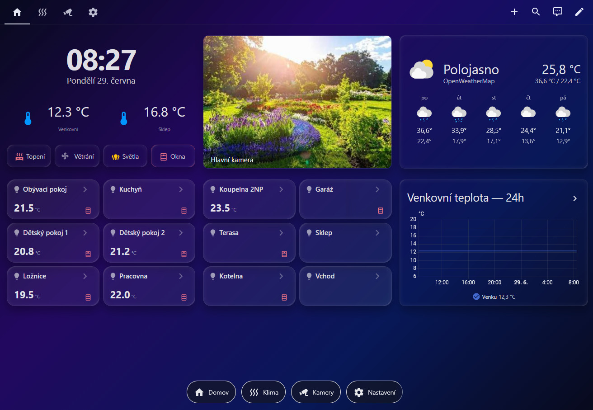

# HA RD Olomouc — Inteligentní řízení domácnosti

Dashboard a konfigurace pro **Home Assistant** s integrací systému **KNX/EIB**. Projekt je určen pro rodinný dům — vizualizace, ovládání a automatizace technických systémů budovy. Do projektu budou postupně přibývat i další systémy (ONVIF kamery, OpenWeatherMap, případně další protokoly).



---

## Použité technologie

| Technologie | Role |
|---|---|
| [Home Assistant](https://www.home-assistant.io/) | Centrální platforma, běží na HA Green |
| [KNX/EIB](https://www.knx.org/) | Sběrnice pro světla, topení, klimatizaci, okna, vrata |
| [Lovelace / YAML dashboardy](https://www.home-assistant.io/dashboards/) | Vizualizace a ovládání |
| [custom:button-card](https://github.com/custom-cards/button-card) | Kustomizované karty místností a tlačítek |
| [custom:bubble-card](https://github.com/Clooos/Bubble-Card) | Pop-up panely pro každou místnost |
| Python skripty | Deploy a správa konfigurace přes SSH/WebSocket API |

---

## Struktura projektu

```
├── dashboard/
│   └── lovelace.yaml          # Kompletní Lovelace konfigurace (4 views)
├── knx-config/
│   └── knx.yaml               # KNX entity (světla, topení, okna, vrata, ventilace)
├── knx-dummy/
│   └── knx_dummy.yaml         # 77 dummy entit pro vývoj bez fyzického KNX
├── packages/
│   ├── heating_logic.yaml     # Logika topení a klimatizace
│   └── heating_schedule.yaml  # Rozvrhy a plánování topení/ventilace
├── scripts/
│   ├── deploy.py              # Nahrání konfigurace na HA (SSH + WebSocket)
│   └── ...                    # Pomocné skripty
├── themes/
│   └── glass_dark.yaml        # Glassmorphism téma
└── DB/                        # Databáze místností a KNX adres (není v gitu)
```

---

## Přehled funkcí

### Views dashboardu
- **Domov** — přehled teplot, rychlé přepínače (topení / větrání / světla / okna), kamera, bloky místností s pop-up detailem
- **Režim klima** — ovládání topení a klimatizace pro každou místnost včetně rozvrhů
- **Kamery** — přehled kamer (ONVIF / Partizán)
- **Nastavení** — ventilace, stavy kontaktů oken a dveří

### KNX skupiny
| Skupina | Funkce |
|---|---|
| 3/1/x | Světla (on/off) |
| 3/2/x | Stmívatelná světla (obývák) |
| 3/3/x | Ventilace |
| 4/0/x | Teplota místnosti (senzory) |
| 4/1/x | Topení — Komfort |
| 4/2/x | Topení — Standby |
| 4/3/x | Topení — Noc/Útlum |
| 4/5/x | Přepínač Topení / Klimatizace |
| 2/1/x | Kontakty oken a dveří |
| 2/2/x | Motory vrat |
| 2/3/x | Tlačítka vrat (impulz) |

### Logika topení
- Tři režimy: **Komfort / Standby / Noc**
- Tři plány pro každou místnost: **Ruční / Vlastní / Společný**
- Rozvrhy editovatelné přímo z HA UI

---

## Hardware

- **Home Assistant Green** — `http://192.168.40.144:8123/`
- **KNX/IP Router** — autodiscovery v HA
- **Kamery Partizán** — ONVIF integrace

---

## HACS závislosti

- `custom:button-card`
- `custom:bubble-card`
- `card-mod` (volitelný)

---

## Deploy

```bash
# Nahrát dashboard na HA
python scripts/deploy.py lovelace

# Nahrát téma
python scripts/deploy.py theme
```

---

## Stav projektu

Projekt je aktivně ve vývoji. Aktuální stav a TODO viz `KONTEXT.md`.
